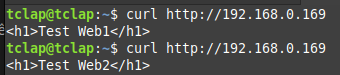
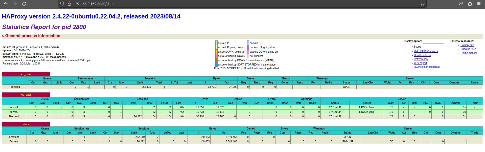

**Haproxy Reverse Proxy**
***
**Tìm hiểu Haproxy**
- HAProxy (High Availability Proxy) là một công cụ mã nguồn mở cho giải pháp cân bằng tải TCP và HTTP.
- Sử dụng HAProxy để cải thiện hiệu suất hoàn thiện của các trang web và ứng dụng bằng cách phân tán khối lượng công việc của chúng trên nhiều máy chủ.
- Cải thiện hiệu suất bao gồm giảm thời gian phản hồi và tăng thông lượng.
- HAProxy cũng được sử dụng trong các hệ thống lớn có lưu lượng truy cập cao như github, reddit, bitbucket,...
- HAProxy bao gồm các tính năng như:
  - Hỗ trợ cân bằng tải ở lớp 4 và lớp 7 (tương ứng với TCP và HTTP).
  - Hỗ trợ giao thức HTTP, gRPC, FastCGI.
  - Lưu trữ chứng chỉ SSL động.
  - Chấm dứt SSL/TLS.
  - Chuyển đổi nội dung và kiểm tra.
  - Ủy quyền minh bạch.
  - Ghi nhật ký chi tiết.
  - Đa luồng.
  - Rewrite URL.
  - Giới han tần số kết nối.
- Các thuật toán cân bằng tải được sử dụng như:
  - Roud-robin: là thuật toán được sử dụng cho HAProxy, các request sẽ lần lượt chuyển tới server.
  - Leastconn: các request sẽ được chuyển tới server có ít kết nối đến nó nhất.
  - Source: các request sẽ được chuyển đến server bằng các hash của IP người dùng.
- Các thuật ngữ trong HAProxy:
  - Access Control List (ACL):
    - Được sử dụng để kiểm tra điều kiện và thực hiện một hành động dựa trên kết quả cảu việc kiểm tra đó.
    - Sử dụng ACL cho phép tạo một môi trường có khả năng chuyển tiêp các request linh hoạt dựa trên các yếu tố khác nhau.
  - Backend:
    - Là một tập các server mà HAProxy có thể chuyển tiếp các request tới.
    - Backend được cấu hình trong mục backend trong tệp cấu hình của HAProxy. 
    - Backend có thể cài đặt bằng cách:
      - Đặt thuật toán cân bằng tải (round-robin, least-connection,..)
      - Danh sách các máy chủ và port có thể nhận request từ HAProxy.
    - Một backend có thể chứa một hoặc nhiều server, HAProxy cho phép một server backup chuyên dụng được sử dụng khi các server offline.
  - Frontend:
    - Được sử dụng để định nghĩa cách mà các request điều hướng cho backend.
    - Được định nghĩa trong mục frontend của cấu hình HAProxy.
    - Các cấu hình cho frontend gồm:
      - Một địa chỉ IP và Port.
      - Các ACL do người dùng định nghĩa.
      - Backend được sử dụng để nhận các request.
- Bảo mật trong HAProxy:
  - Một số tính năng có thể hạn chế tấn công như cô lập chính nó sử dụng chroot, drop ngay các user/group không có các quyền đặc biệt khi khởi động và tránh truy cập vào ổ cứng khi khởi động.
  - Sử dụng HAProxy để theo dõi lưu lượng truy cập và giám sát hành vi khách hàng thông qua các yêu cầu, cũng có thể giới hạn tốc độ và danh sách IP Blacklist/Whitelist.
***
**Bài tập: Setup HAProxy hỗ trợ Mode TCP và HAProxy Stats.**
- Hệ thống được cài đặt với bộ cân bằng tải HAproxy và các webserver được cài trên các máy ảo Ubuntu 22.04 được cài đặt trên Proxmox. Địa chỉ IP của các server:
    - haproxy: 192.168.0.169
    - web1: 192.168.0.170
    - web2: 192.168.0.171
- Thực hiện cài đặt webserver Apache2 ở máy ảo web1 và web2: 
    ~~~
        apt-get install apache2

        #Trên web1
        echo "<h1>Test Web1</h1>" > /var/www/html/index.html
        
        #Trên web2
        echo "<h1>Test Web2</h1>" > /var/www/html/index.html
        
        systemctl start apache2
    ~~~
- Tại máy ảo HAproxy server:
  1. Cài đặt HAProxy:
    ~~~
        apt-get update
        apt-get install haproxy
    ~~~
  2. Cấu hình HAProxy:
     - Sau khi HAProxy được cài đặt, cấu hình để cân bằng tải lưu lượng TCP. Tệp cấu hình cho HAProxy ở /etc/haproxy/haproxy.cfg.
     - Mở tệp cấu hình:
    ~~~
        vi /etc/haproxy/haproxy.cfg
    ~~~
     - Trong tệp cấu hình, xác định một "frontend" lắng nghe các kết nối TCP đến và một "backend" phân phối các kết nối đến máy chủ web:
    ~~~
        frontend tcp_front
            bind *:80
            mode tcp
            default_backend	tcp_back

        backend tcp_back
            balance roundrobin
            server web1 192.168.0.170:80 check
            server web2 192.168.0.171:80 check
    ~~~
     - Trong phần cấu hình trên: 
       - Dòng "frontend" có tên “tcp_front” đang lắng nghe các kết nối TCP trên cổng 80. 
       - Dòng “mode tcp” cho biết frontend này đang xử lý lưu lượng TCP.
       - Dòng "backend" có tên “tcp_back” chịu trách nhiệm phân phối các kết nối đến máy chủ. 
       - Dòng “balance roundrobin” cho biết các máy chủ sẽ được sử dụng theo kiểu round-robin, nghĩa là mỗi máy chủ sẽ được sử dụng lần lượt.
       - Dòng “server” xác định các máy chủ sẽ được sử dụng. Với “192.168.0.170” và “192.168.0.171” là địa chỉ IP của máy chủ web1, web2 và “80” bằng số cổng mà ứng dụng đang chạy. 
       - Từ khóa “check” yêu cầu HAProxy kiểm tra định kỳ xem máy chủ có còn khả dụng hay không.
  3. Giám sát với HAProxy Stats:
     - Để theo dõi hiệu suất và trạng thái máy chủ, HAProxy bao gồm giao diện thống kê tích hợp có thể kích hoạt để giám sát quá trình thiết lập.
     - Để bật giao diện thống kê, hãy thêm các dòng sau vào tệp cấu hình HAProxy:
    ~~~
        listen stats
            mode http
            bind *:8080
            stats enable
            stats refresh 20s
            stats auth admin:password
            stats uri /stats
    ~~~
     - Trong đó:
       - Cấu hình này tạo ra một phần mới có tên là “stats” lắng nghe trên cổng 8080.
       - Dòng “mode http” cho biết "stats" đang xử lý lưu lượng HTTP. 
       - Dòng “stats enable” kích hoạt giao diện thống kê.
       - Dòng “stats uri /stats” đặt đường dẫn URL nơi có thể truy cập trang thống kê. 
       - Dòng “stats refresh 20s” đặt trang làm mới sau mỗi 20 giây.
       - Dòng "stats auth admin:password", sử dụng tài khoản để xác thực vào trang thông kê với tên người dùng là "admin" và mật khẩu là "password".
  4. Xác thực và áp dụng cấu hình:
     - Sau khi chỉnh sửa tệp cấu hình, phải xác thực cấu hình để đảm bảo không có lỗi cú pháp:
    ~~~
        haproxy -c -f /etc/haproxy/haproxy.cfg
    ~~~
     - Nếu cấu hình hợp lệ, lệnh sẽ xuất ra “Configuration file is valid”. Nếu có bất kỳ lỗi nào, lệnh sẽ xuất ra thông báo lỗi chi tiết có thể giúp khắc phục sự cố.
     - Sau khi cấu hình được xác thực, khởi động lại HAProxy:
    ~~~
        systemctl restart haproxy
    ~~~
  5. Kiểm tra cài đặt:
    - Gửi yêu cầu từ máy khách, sử dụng công cụ như Curl để gửi yêu cầu từ máy khách đến máy chủ HAProxy.
    - 
    - Truy cập số liệu thống kê HAProxy bằng URL: `http://192.168.0.169:8080/stats` và sử dụng tài khoản được cấu hình bằng "stats auth" trong tệp cấu hình.
    - 