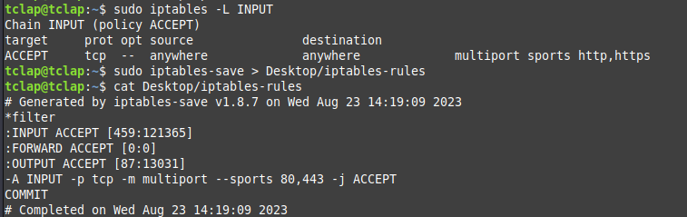
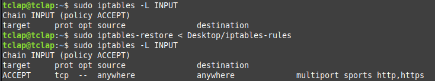

**Tìm hiểu về iptables**

1. Stateless Packet Filtering
   - Stateless Packet Filtering (SPF) là một phương pháp quản lú tường lửa trong hệ thống mạng.
   - Trong SPF, quyết định về việc chấp nhận hoặc từ chối các gới tin mạng được thực hiện dựa trên thông tin có sẵn trong từng gói tin độc lập, mà không cần theo dõi trạng thái kết nối của gói tin.
   - SPF không duy trì thông tin về các kết nối mạng đã thiết lập.
   - Các Stateless Packet Filtering hoạt động:
     - Thông tin gói tin: SPF kiểm tra các thông tin trong tiêu đề của gói tin, bao gồm địa chỉ nguồn và đích, cổng nguồn và đích cùng với thông tin giao thức như TCP, UDP, ICMP.
     - So sánh với quy tắc: SPF so sánh các thông tin trong gói tin với các quy tắc đã được định nghĩa trước. Những quy tắc này xác định cách xử lý gói tin dựa trên cách thuộc tính như địa chỉ IP, cổng và giao thức.
     - Hành động: dựa trên kết qủa so sánh, SPF quyết định xem gói tin sẽ được chấp nhận (ACCEPT), từ chối (DROP) hoặc bị từ chối và gửi thông báo lỗi (REJECT).
     - Không duy trì trạng thái: SPF không theo dõi trạng thái của các kết nối mạng, nên SPF không biết gói tin cụ thể có liên quan đến một kết nối mạng nào đó trước đó hay không.
   - Lợi ích của SPF:
     - Hiệu suất cao: vì SPF không cần duy trì thông tin trạng thái kết nối nên có thể xử lý các gói tin nhanh chóng và hiệu quả.
     - Đơn giản: SPF không đòi hỏi lữu trữ thông tin về trạng thái kết nối làm cho cấu hình tường lửa dễ dàng hơn.
    - Một số hạn chế:
      - SPF không thể xác định trạng thái của các kết nối mạng, có thể ảnh hưởng đến khả năng xử lý các giao thức yêu cầu duy trì trạng thái như FTP hoặc VoIP.    
      - SPF không thể xử lý các kịch bản mạng phức tạp hoặc yêu cầu kiểm tra trạng thái kết nối liên tục.
2. Stateful Packet Filtering
   - Stateful Packet Filtering (SfulPF) là một phương pháp quản lý tường lửa trong mạng máy tính.
   - Quyết định về việc chấp nhận hoặc từ chối các gói tin mạng dựa trên việc theo dõi và duy trì trạng thái của các kết nối mạng.
   - SfulPF giúp tường lửa hiểu được bối cảnh của các gói tin trong ngữ cảnh của các kết nối mạng từ đó tăng khả năng kiểm soát và bảo mật hệ thống mạng.
   - Các SfulPF hoạt động:
     - Duy trì trạng thái: theo dõi thông tin về các kết nối mạng đã thiết lập bằng cách lưu trữ thông tin về trạng thái của các gói tin trong các kết nối như TCP, UDP, ICMP.
     - Theo dõi kết nối: theo dõi các thông tin về trạng thái kết nối như trạng thái kết nối hiên tại (đã thiết lập, đang chờ, đã kết thúc), địa chỉ IP nguồn và đích, cổng nguồn và đích, và các thông tin khác.
     - So sánh quy tắc: so sánh các thông tin về trạng thái kết nối của các gói tin với các quy tắc đã được định nghĩa trước. Các quy tắc này có thể xác định cách xử lý các gói tin dựa trên trạng thái của kết nối mạng.
     - Hành động dựa trên trạng thái: dựa trên thông tin về trạng thái kết nối sẽ quyết định xem gói tin sẽ được chấp nhận (ACCEPT), từ chối (DROP) hoặc bị từ chối và gửi thông báo lỗi (REJECT). 
   - Lợi ích của SfulPF:
     - Phân biệt được kết nối tin cậy: giúp tường lửa phân biệt được các kết nối đã thiết lập và kết nối mới, từ đó tăng khả năng phát hiện và ngăn chặn các cuộc tấn công.
     - Quản lý dễ dàng: giúp tường lửa tự động xác định trạng thái kết nối và áp dụng các quy tắc phù hợp mà không cần cấu hình thủ công cho từng gói tin.
     - Hỗ trợ các giao thức phức tạp: hỗ trợ xử lý các giao thức yêu cầu duy trì trạng thái như FTP, SIP (Session Initiation Protocol) và các ứng dụng yêu cầu kết nối liên tục.
   - Bên cạnh đó, SfulPF có thể đòi hỏi một lượng tài nguyên hệ thống nhất định để duy trì thông tin về trạng thái của các kết nối mạng và việc cấu hình có thể phức tạp so với SPF.

3. Command Iptables

- Iptables là một công cụ quản lý tường lửa trong hệ thống Linux.
- Cho phép kiểm soát, quản lý và lọc lưu lượng mạng đến và đi từ máy chủ hoặc máy tính cá nhân.
- Một số khái niệm của Iptables:
  - Chain (chuỗi): iptables sử dụng các chuỗi để quản lý lưu lượng mạng. Các chuỗi chính bao gồm:
    - INPUT: kiểm soát lưu lượng đến máy chủ.
    - OUTPUT: kiểm soát lưu lượng ra khỏi máy chủ.
    - FORWARD: kiểm soát lưu lượng chuyển tiếp qua máy chủ.
  - Rule (quy tắc): mỗi chuỗi chứa các quy tắc, quy tắc xác định cách xử lý gói tin dựa trên các tiêu chí như địa chỉ IP nguồn, đích, cổng và giao thức.
  - Table (bảng): iptables sử dụng các bảng để xác định các các quy tắc được áp dụng. Các bảng chính bao gồm:
    - Filter: dùng để kiểm soát việc chấp nhận hoặc từ chối lưu lượng mạng.
    - NAT (Netwwork Address Translation): dùng để thay đổi địa chỉ IP và cổng trong các gói tin.
    - Mangle: dùng để tùy biến thông tin tiêu đề của gói tin.
    - Raw: dùng để không xử lý một số gói tin nhất định.
  - Target (mục tiêu): quy định hành động cụ thể mà iptables sẽ thực hiện với các gói tin khi một quy tắc được áp dụng. Một số mục tiêu như:
    - ACCEPT: cho phép gói tin đi qua.
    - DROP: từ chối gói tin.
    - REJECT: từ chối và gửi thông báo cho người gửi.
  - Chain Policies ( chính sách chuỗi): mỗi chuỗi có một chính sách mặc định, định nghĩa hành động mà iptables sẽ thực hiện nếu không có quy tắc cụ thể nào khớp. 
- Các sử dụng iptables:
  - Hiển thị tất cả các quy tắc: `iptables -L`
  - Hiển thị tất cả các quy tắc với số dòng: `iptables -L --line-numbers`
  - Hiển thị tất cả các quy tắc với đầu ra chi tiết của các gói đang hoạt động: `iptables -n -L -v`
  - Hiển thị quy tắc cho chuỗi NAT: `iptables -t nat -L`
  - Hiển thị quy tắc cho một quy tắc chuỗi cụ thể: `iptables -L INPUT/OUTPUT/FORWARD`
  - Thêm quy tắc: `iptables -A <chain> <rule>`
  - Xóa quy tắc: `iptables -D <chain> <rule_number>`
  - Thêm một chuỗi mới: `iptables -N custom-filter`
***
**Iptables Rule**

**1. Allow Port:**
  - Cho phép một port, thêm một quy tắc vào chain INPUT: 
    - `iptables -A INPUT -p <tcp/udp> --dport <port> -j ACCEPT`
    - `iptables -A INPUT -p <tcp/udp> --sport <port> -j ACCEPT`
  - Trong đó:
    - **-A INPUT**: Thêm quy tắc vào chain INPUT.
    - **-p**: Xác định giao thức TCP/UDP.
    - **--dport**: Xác định cổng đích.
    - **--sport**: Xác định cổng nguồn.
    - **-j ACCEPT**: Hành động là chấp nhận gói tin.
  - Cho phép nhiều port trong một quy tắc sử dụng tùy chọn "-m multiport":
     - `iptables -A INPUT -p <tcp/udp> -m multiport --dport <port1>,<port2> -j ACCEPT`
     - `iptables -A INPUT -p <tcp/udp> -m multiport --sport <port1>,<port2> -j ACCEPT`
  - Tùy trương hợp, có thể sử dụng chain OUTPUT hoặc chain FORWARD. 

**2. Chặn source IP toàn bộ hoặc theo Port:**   
   - Chặn toàn bộ một địa chỉ IP hoặc một mạng con đi vào máy chủ: `iptables -A INPUT -s <host/subnet> -j DROP`
   - Chặn theo port, bổ sung các tùy chọn "--sport <port>", "--dport <port>": 
     - `iptables -A INPUT -s <host/subnet> --dport <port> -j DROP`
     - `iptables -A INPUT -s <host/subnet> --sport <port> -j DROP` 
   - Tùy trương hợp, có thể sử dụng chain OUTPUT hoặc chain FORWARD.

**3. Save rule/ restore rule**
  - Iptables không cung cấp cơ chế lưu trực tiếp, có thể sử dụng các công cụ hỗ trợ như iptables-save và iptables-restore.
  - Để lưu các quy tắc đã tạo ra file để có thể phục hồi sau này. 
    ~~~
        iptables-save > /etc/iptables-rules
    ~~~
  - 
  - Để phục hồi quy tắc từ tập tin:
    ~~~
        iptables-restore < /etc/iptables-rules
    ~~~
  - 
 
**4. Iptables extensions - Ứng dụng thực tế modules: recent, set, connlimit**
- Các iptables extensions (tiện ích mở rộng) như "recent", "set" và "connlimit" là các công cụ mạnh mẽ giúp thực hiện các tác vụ quản lý tường lửa phức tạp hơn. 

**Extension "recent":**
- Module "recent" cho phép theo dõi và quản lý các kết nối gần đây, như chặn các địa chỉ IP sau khi đã gửi một số lượng cố gắng kết nối sai lần lượt.
- Chặn IP sau khi có nhiều yêu cầu HTTP không hợp lệ trong khoảng thời gian ngắn, IP sẽ bị chặn nếu gửi ít nhất 5 yêu cầu HTTP sai trong vòng 60 giây:
    ~~~
    iptables -A INPUT -p tcp --dport 80 -m recent --update --seconds 60 --hitcount 5 -j DROP
    iptables -A INPUT -p tcp --dport 80 -m recent --set -j ACCEPT
    ~~~
- Chặn IP sau khi có nhiều yêu cầu SSH sai trong khoảng thời gian ngắn:
    ~~~
    # Tạo một tập tin recent để lưu trạng thái kết nối
    iptables -A INPUT -p tcp --dport 22 -m recent --name sshbruteforce --set -j ACCEPT

    # Chặn IP nếu đã có nhiều yêu cầu trong vòng 60 giây
    iptables -A INPUT -p tcp --dport 22 -m recent --name sshbruteforce --update --seconds 60 --hitcount 3 -j DROP
    ~~~
    
**Extension "set":**
- Module "set" cho phép tạo và quản lý tập hợp các đối tượng như địa chỉ IP, dãy cổng, để sau đó sử dụng chúng trong các quy tắc.
- Thực hiên cài đặt "ipset":
  ~~~
    #Centos
    yum install ipset

    #Ubuntu
    apt install ipset
  ~~~
- Cho phép các IP trong tập hợp được truy cập cổng 22 (SSH):
    ~~~
    ipset create allowed_ips hash:ip
    ipset add allowed_ips 192.168.1.100
    iptables -A INPUT -p tcp --dport 22 -m set --match-set allowed_ips src -j ACCEPT
    ~~~
- Quản lý danh sách các địa chỉ IP được phép truy cập cổng 80 (HTTP):
    ~~~
    # Tạo tập hợp IP
    ipset create allowed_ips hash:ip

    # Thêm IP vào tập hợp
    ipset add allowed_ips 192.168.1.100

    # Cho phép các IP trong tập hợp truy cập cổng 80
    iptables -A INPUT -p tcp --dport 80 -m set --match-set allowed_ips src -j ACCEPT
    ~~~
**Extension "connlimit":**
- Module "connlimit" cho phép kiểm soát số lượng kết nối đến hoặc từ một địa chỉ IP cụ thể.
- Giới hạn số lượng kết nối đến cổng 80 của một địa chỉ IP, nếu một IP đã có hơn 10 kết nối đến cổng 80, thì các kết nối mới sẽ bị từ chối:
    ~~~
    iptables -A INPUT -p tcp --dport 80 -m connlimit --connlimit-above 10 -j DROP
    ~~~