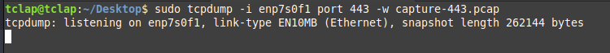
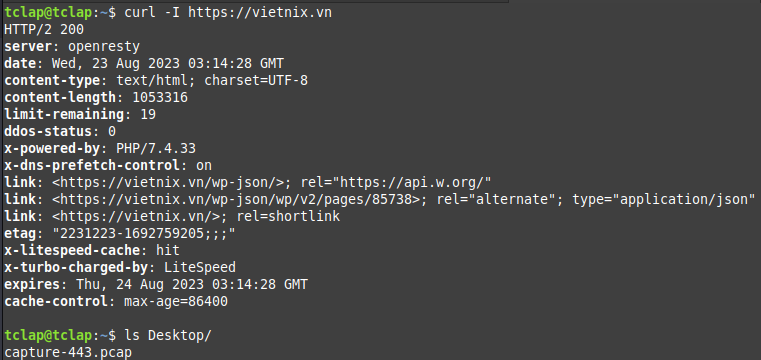
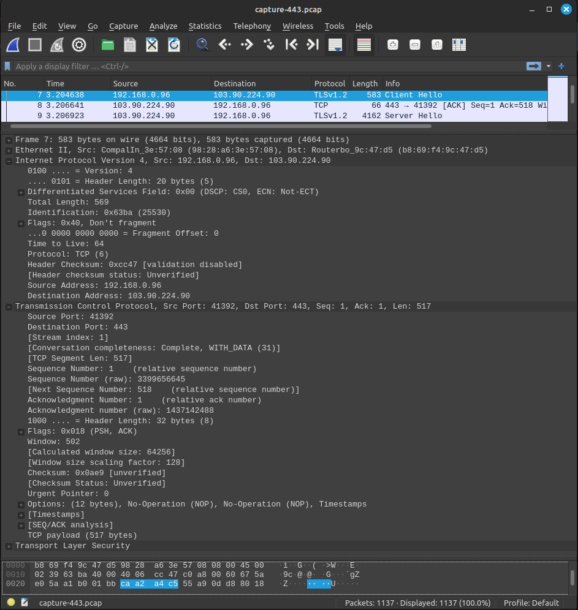
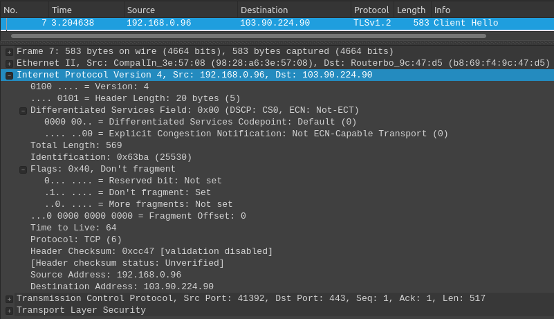
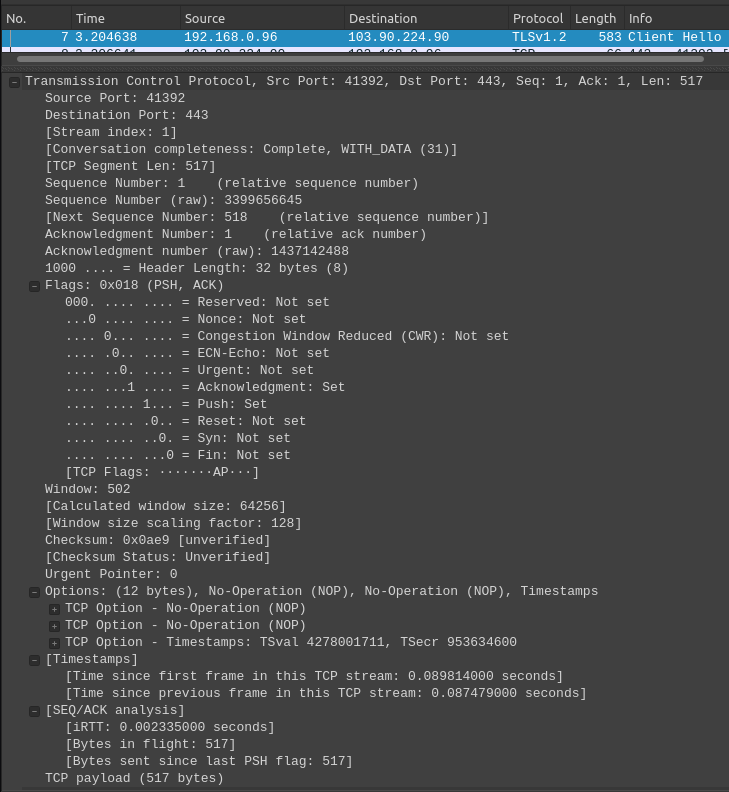

**Lý thuyết TCP Header**
- Một gói tin TCP bao gồm 2 phần header (có độ dài 20 bytes) và dữ liệu
- Phần header có 11 trường trong đó 10 trường bắt buộc. Trường thứ 11 là tùy chọn có tên là: options 
- Header TCP (Transmission Control Protocol) là một phần quan trọng trong giao thức TCP, được sử dụng để thiết lập, duy trì và đóng kết nối giữa các máy tính trên mạng. 
- Header TCP chứa các thông tin cần thiết để điều khiển truyền thông và đảm bảo tính đáng tin cậy của dữ liệu trao đổi qua mạng.
- Ý nghĩa của các trường quan trọng trong header TCP:
  - Source port (16 bits): 
    - Địa chỉ cổng nguồn của gói tin TCP, xác định quá trình gửi dữ liệu trên máy gửi.
  - Destination port (16 bits):
    - Địa chỉ cổng đích của gói tin TCP, xác định quá trình nhận dữ liệu trên máy nhận.
  - Sequence number (32 bits):
    - Số thứ tự của byte đầu tiên trong gói dữ liệu. 
    - Được sử dụng để xác định thứ tự của các gói tin trong quá trình tái tạo dữ liệu ban đầu.
  - Acknowledgement number (32 bits):
    - Số thứ tự của gói tin kết thúc của bên nhận. 
    - Được sử dụng để xác nhận các gói tin đã được nhận thành công.
  - Data offset:
    - Trường có độ dài 4 bít quy định độ dài của phần header (tính theo đơn vị từ 32 bít). 
    - Phần header có độ dài tối thiểu là 5 từ (160 bit) và tối đa là 15 từ (480 bít).
  - Reserved (4 bits): dành cho tương lai và có giá trị là 0.
  - Flags (hay Control bits) để điều khiển và kiểm soát quá trình truyền dữ liệu, bao gồm 8 cờ:
    - CWR (1 bit): Congestion Window Reduced
    - ECE (1 bit): ECN-Echo
    - URG: Cờ cho trường Urgent pointer.
    - ACK: Cờ cho trường Acknowledgement.
    - PSH: Hàm Push.
    - RST: Thiết lập lại đường truyền.
    - SYN: Đồng bộ lại số thứ tự.
    - FIN: Không gửi thêm số liệu.
  - Window (16 bits): số byte có thể nhận, bắt đầu từ giá trị của trường báo nhận (ACK).
  - Checksum (16 bit):
    - Kiểm tra toàn vẹn dữ liệu trong header và dữ liệu, để đảm bảo rằng gói tin không bị hỏng trong quá trình truyền.
  - Urgent pointer:
    - Nếu cờ URG bật thì giá trị trường này chính là số từ 16 bít mà số thứ tự gói tin (sequence number) cần dịch trái.
  - Options: 
    - Nếu có thì độ dài là bội số của 32 bít.
    - Các tùy chọn mở rộng cho header TCP, chẳng hạn như tùy chọn cửa sổ băng thông, tùy chọn mã hóa,...
  - Data:
    - Trường cuối cùng không thuộc về header. 
    - Giá trị của trường này là thông tin dành cho các tầng trên (trong mô hình 7 lớp OSI).
- Header TCP có thể chứa các tùy chọn mở rộng để cung cấp khả năng linh hoạt và điều chỉnh chi tiết cho quá trình truyền thông. Một số tùy chọn thường được sử dụng trong header TCP:
  - Maximum Segment Size (MSS): 
    - Tùy chọn này cho phép các máy tính trao đổi thông tin về kích thước tối đa của các segment dữ liệu có thể gửi.
    - Giúp ứng dụng tránh gửi quá nhiều dữ liệu cùng một lúc, dẫn đến tăng cường hiệu suất truyền thông.
  - Window Scale:
    - Tùy chọn này mở rộng kích thước của cửa sổ trược bằng cách thêm một giá trị scale factor.
    - Điều này cho phép của sổ trượt lớn hơn với giá trị chỉ số thấp hơn, giúp hỗ trợ các mạng có băng thông lớn.
  - Selective Acknowledgment (SACK):
    - Tùy chọn này cho phép bên nhận xác định chính xác những gói tin đã nhận được và nhưng gói tin cần được tái gửi.
    - Giúp tăng hiệu suất và độ tin cậy của truyền thông trông trường hợp mất dữ liệu hoặc thứ tự bị đảo lộn.
  - Timestamps:
    - Cho phép đồng bộ hóa thời gian giữa các máy tính trên mạng.
    - Hữu ích trong việc tính toán RTT (Round-Trip Time).  
***
**Lý thuyết IP Header**
- Header IP (Internet Protocol header) là một phần quan trọng của gói tin mạng trong mô hình TCP/IP.
- Chứa thông tin cần thiết để định tuyến và giao tiếp giữa các thiết bị mạng.
- Header IP thương xuất hiện trong các giao thức mạng như IPv4 hoặc IPv6.
- Một số thông tin cơ bản về header IP trong giao thức IPv4:
  - Version (4 bits): 
    - Là phiên bản của giao thức IP được sử dụng.
    - Trong IPv4 giá trị của trương này luôn là 4.
  - IHL (Internet Header Length, 4 bits): 
    - Là độ dài của header IP, được đo bằng số lượng từ 32 bít (4 bytes) trong header.
    - Giá trị này xác định độ dài tối thiểu của header IP, thông qua xác định được phần dữ liệu sau header.
  - Type of Service (8 bits):
    - Được thiết kế để quản lý việc ưu tiên giao tiếp và định tuyến trong mạng.
  - Total Length (16 bits):
    - Tổng độ dài của gói tin, bao gồm cả header và dữ liệu được tính bằng đơn vị byte.
  - Identification (16 bits):
    - Được sử dụng để đánh dấu duy nhất cho mỗi gói tin.
    - Hữu ích trong việc xử lý gói tin gửi lại hoặc trong trường hợp gói tin bị chia nhỏ (fragmentation).
  - Flags (3 bits):
    - Các cờ điều kiển quá trình fragmentation (chia nhỏ) và hợp nhất lại (reassembly) của gói tin.
  - Fragment Offset (13 bits):
    - Xác định vị trí của các phần dữ liệu trong gói tin sau khi nó bị chia nhỏ, đơn vị là byte.
  - Time to Live (TLL, 8 bits):
    - Chỉ định số lượng bước lặp tối đa mà gói tin có thể đi qua trước khi bị hủy bỏ.
    - Được sử dụng để ngăn chặn các gói tin bị kẹt trong vòng lặp vô tận.
  - Protocol (8 bits):
    - Chỉ ra giao thức lớp trên như TCP, UDP, ICMP sẽ được sử dụng để xử lý dữ liệu sau header IP.
  - Header Checksum (16 bits):
    - Là giá trị kiểm tra lỗi của phần header.
    - Giúp xác định xem header IP đã bị hỏng trong quá trình truyền dẫ hay không.
  - Source IP Address (32 bits): địa chỉ IP của thiết bị gửi gói tin.
  - Destination IP Address (32 bits): địa chỉ của thiết bị nhận gói tin.
  - Options (0-320 bits): 
    - Có thể không xuất hiện trong header.
    - Nếu xuất hiện, có thể chứa các thông tin mở rộng hoặc cấu hình thêm.
- Cả IPv4 và IPv6 đều sử dụng cấu trúc tương tự cho header IP, nhưng có một số sự khác biệt trong các trường và tính năng để phù hợp hơn với các yêu cầu và cải tiến của giao thức       
***
**Bài tập: dùng tcpdump bắt gói tin, mở lên bằng wireshark và chỉ ra các header của gói tin đã bắt.**
- **Tcpdump** là một công cụ dòng lệnh trên hệ thống Linux được sử dụng để phân tích và ghi lại lưu lượng mạng. Cách sử dụng tcpdump trên Linux:
    
    **1. Hiển thị tất cả các gói mạng trên một giao diện cụ thể:**
    ```
    sudo tcpdump -i <interface>
    ```
    **2. Lưu lượng gói mạng vào một tệp:**
    ```
    sudo tcpdump -i <interface> -w <output_file>
    ```
    **3. Lắng nghe trên một cổng cụ thể:**
    ```
    sudo tcpdump -i <interface> port <port_number>
    ```
    **4. Lắng nghe trên một địa chỉ IP cụ thể:**
    ```
    sudo tcpdump -i <interface> host <ip_address>
    ```
    **5. Sử dụng biểu thức điều kiện:**
    ```
    sudo tcpdump -i <interface> <expression>
    ```
- Thực hiện bắt các gói gói tin và lưu vào tệp "capture-443.pcap":
    - 
    - 
- Mở tệp "capture-443.pcap" lên bằng wireshark:
  - Mở wireshark, chọn "File" => chọn "Open" => chọn tệp "capture-443.pcap" => chọn "Open".
  - 
- Các header của 1 gói tin đã bắt:
  - IP header:
    - 
  - TCP header:
    -  
