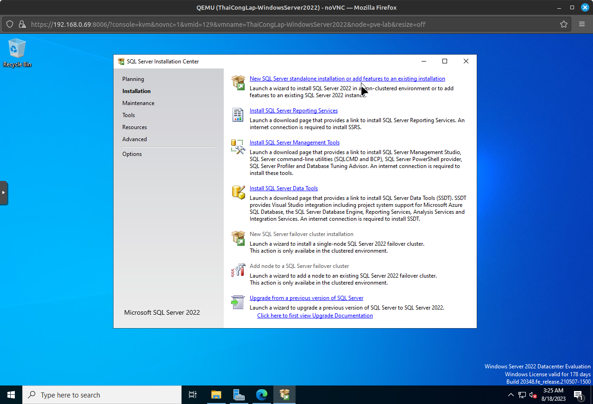
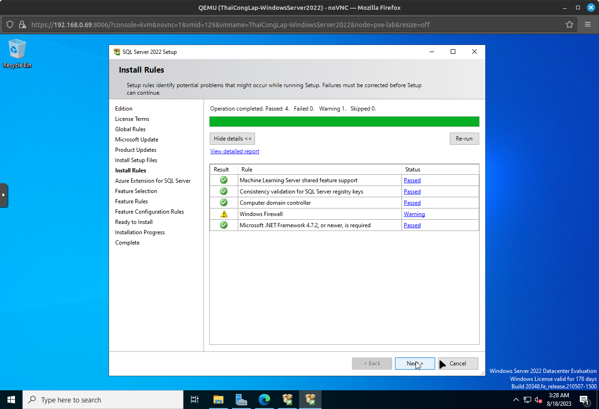
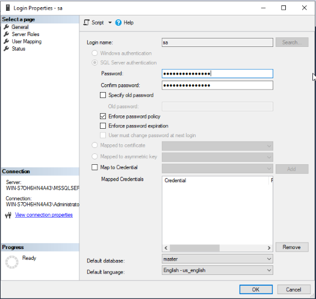

***
**Bài tập 1**
1. Cài đặt Windows Server 2022 
   - Tải hình ảnh iso của hệ điều hành windows server 2022: https://www.microsoft.com/en-us/evalcenter/download-windows-server-2022
   - Tải VirtIO drivers: https://fedorapeople.org/groups/virt/virtio-win/direct-downloads/archive-virtio/virtio-win-0.1.215-2/virtio-win-0.1.215.iso
   - Tải lên tệp ISO máy chủ windows 2022 và VirtIO drivers lên máy chủ Proxmox.
   - Tạo máy chủ Windows 2022 VM
     - Cấu hình chung.
       - Node: Chọn nút Proxmox nơi sẽ cài đặt máy chủ windows 2022.
       - VM ID: ID mới sẽ được tạo tự động.
       - Name: Nhập tên của máy ảo.
     - Cấu hình hệ điều hành, cần trỏ đến hình ảnh ISO đã tải lên trên máy chủ Proxmox.
       - Use CD/DVD disk image file
         - Storage: local
         - ISO image: Chọn tệp hình ảnh iso của windows server 2022.
       - Guest OS:
         - Type: Microsoft Windows
         - Version: 11/2022.
     - Cấu hình hệ thông.
       - Chọn OVMF (UEFI) trong Bios, cho phép khởi động an toàn.
       - Lưu trữ TPM: local-lvm
       - Phiên bản: chọn v2.0
     - Cấu hình đĩa cứng ảo.
       - BUS/Device: Đổi thành VirtIO Block.
       - Disk Size: 60GB.
     - Cấu hình CPU: Total cores = 4.
     - Memory: 8192
     - Bỏ chọn tùy chọn "Start after created" tại giao diện Confirm.
   - Đính kèm trình điều khiển VirtIO vào máy chủ Windows 2022 VM.
     - Chọn máy ảo và nhấp vào hardware-> Add-> CD/DVD Drive.
     - Trong cửa sổ bật lên, đính kèm tệp iso VirtIO từ máy cục bộ và nhấp vào "Add".
   - Bắt đầu cài đặt windows server 2022 trong Proxmox. Trình hướng dẫn cài đặt VM sẽ mở ra:
     - The Language
     - Time and Currency format
     - Keyboard layout and click on next.
     - 
     - Chọn "Install now".
     - 
     - Chọn "addition" máy chủ windows. Máy chủ windows có sẵn trong hai phần bổ sung, Standard hoặc Datacenter và trong các phần bổ sung đó, các bản cài đặt dựa trên CLI và GUI đều có sẵn. 
     - 
     - Chọn "Datacenter with Desktop experience" và sau đó nhấp vào "Next".
     - Chấp nhận thỏa thuận cấp phép và nhấp vào "Next".
     - Chọn cài đặt tùy chỉnh.
     - 
     - Cấu hình đĩa cứng ảo.
       - Nhấp vào "Load driver".
       - Nhấn "Ok"
       - 
       - Chọn máy chủ Windows 2022 từ danh sách và nhấp vào "Next"
       - 
       - Chọn đĩa cứng và nhấp vào "Next".
       - 
       - 
       - Quá trình cài đặt hoàn tất và sẽ được yêu cầu đặt mật khẩu cho quản trị viên. 
       - 
       - Đặt mật khẩu và nhấp vào "Finish".
       - 
     - Cập nhật Driver trên máy chủ Windows 2022
       - Vào trình "server manager"-> "Tools"-> "Computer management".
       - Trong cửa sổ "Computer management", chọn "Device manager".
       - Chọn "Other devices" -> "PCI device".
       - Nhấp chuột phải vào "PCI device" và nhấp vào "Update driver".
       - 
       - Trong cửa sổ bật lên, nhấp vào "Browse my computer for drivers".
       - 
       - Chọn Ổ đĩa CD VirtIO và nhấp vào "Next".
       - 
       - Quá trình cài đặt hiện đã hoàn tất thành công.
       - 
     - Cài đặt Guest Agent trên máy chủ windows 2022
       - Mở ổ đĩa CD VirtIO trong windows explorer.
       - Nhấp đúp vào qemu-ga-x86_64 để cài đặt  qemu trên Windows 2022.
       - 
2. IIS Server (yêu cầu khi truy cập vào localhost hiện thị được trang web mặc định của IIS)
   - Mở "Server Manager dashboard" và nhấp vào "Add roles and features".
   - 
   - Before you begin, chọn Next.
   - 
   - Chọn Role-based or feature-based installation, chọn Next.
   - 
   - Chọn máy chủ muốn thêm dịch vụ vào và chọn Next.
   - 
   - Tại "Server roles":
     - Chọn Web Server (IIS).
     - 
     - Cửa sổ mới sẽ xuất hiện, chọn Add Features.
     - 
     - Chọn Next.
   - Tiếp tục chọn Next tới "Confirmation" và chọn "Install".
   - 
   - Cài đặt thành cộng, chọn Close.
   - 
   - Thực hiện truy cập trình duyệt, nhập địa chỉ localhost:
   - 
3. SQL Server (yêu cầu phải bật được SQL Agents và login được bằng tài khoản "sa")
- Truy cập trang https://www.microsoft.com/en-us/sql-server/sql-server-downloads và tải xuống Phiên bản dành cho nhà phát triển SQL Server 2019.
- Chạy ứng dụng cài đặt SQL Server 2019:
- 
- Nhấp vào tab "Custom"
- Chọn ổ đĩa cài đặt và chọn "Install".
- 
- Click on “Installation“ và chọn "New SQL Server standalone..."
- 
- Chỉ định phiên bản muốn cài đặt, chọn "Developer" và chọn "Next"
- 
- Tích chọn “I accept the license terms and Privacy Statement” và chọn “Next“.
- Có thể chọn “Microsoft update” để kiểm tra các bản cập nhật tự động, sau đó nhấp vào “Next“.
- Windows sẽ kiểm tra hệ thống để tìm ra bất kỳ sự cố tiềm ẩn nào có thể xảy ra trong khi thiết lập đang chạy, chọn "Next"
- 
- Trong "Feature Selection", có thể lựa chọn các tính năng mà SQL Server đi kèm. Nhấp vào “Tiếp theo”.
- 
- Đặt tên, ID và nhấp vào “Next“.
- 
- Trong "Server Configuration", nhấp vào “Next” với các cấu hình mặc định.
- 
- Cấu hình tham số Database Engine, bước này có thể chọn các cơ chế xác thực sẽ sử dụng, đặt mật khẩu cho tài khoản quản trị viên ```"sa"``` và chọn các tài khoản quản trị viên khác. Xác thực ở chế độ hỗn hợp trong đó người dùng có thể đến từ một miền hoặc được thêm thủ công vào phiên bản SQL. Nhập mật khẩu và bất kỳ cài đặt nào khác muốn định cấu hình. Nhấp vào “Next” khi hoàn tất.
- 
- "Ready to install" đưa ra một bản tóm tắt về các gói đã chọn để cài đặt, các cài đặt đã định cấu hình, v.v. Nhấp vào “Install“
- 
- Sau khi mọi thứ đã được cài đặt. Nhấp vào “Đóng” trên cửa sổ “Complete”.
- 
- Thực hiện tải SSMS tại https://learn.microsoft.com/en-us/sql/ssms/download-sql-server-management-studio-ssms?view=sql-server-ver16 và cài đặt SQL Server Management Studio (SSMS).
- Mở SSMS, thực hiện đăng nhập SQL server bằng tài khoản "sa":
- 
- 
***
Bài tập 2: Reset mật khẩu Windows Server 2022 (bắt buộc dùng chntpw tools ở Kali Linux để reset password)
- Thực hiện chỉnh sửa BIOS của Windows Server 2022 từ OVMF (UEFI boot mode) sang SeaBIOS (SeaBIOS boot mode) và thêm CD/DVD Kali Live vào Windows Server 2022.
- .
- Khởi động máy ảo Windows server và chọn chế độ "Live system" trong Kali Linux live menu (BIOS mode)
- .
- Mở terminal và di chuyển vào thư mục "../Windows/System32/config/"
- 
- Chỉnh sửa cơ sở dữ liệu SAM bằng công cụ `chntpw` và nhập 1 để chọn tùy chọn "Chỉnh sửa dữ liệu người dùng và mật khẩu" và nhấn ENTER.
- 
- Nhập số người dùng (RID). Đặt lại mật khẩu của người dùng có tên "Administrator", nhập RID là "01f4".
- 
- Nhập 1 để xóa mật khẩu người dùng và nhấn ENTER.
- 
- Tiếp theo nhập q và nhấn ENTER để thoát khỏi chỉnh sửa người dùng và quay lại menu trước đó.
- 
- Gõ q để thoát menu tương tác chntpw:
- 
- Nhập y và nhấn ENTER để lưu và thoát menu tương tác chntpw.
- 
- Mật khẩu người dùng của Windows đã được đặt lại.
- Xóa đĩa CD, chuyển BIOS về chế độ OVMF (UEFI) và khởi động lại hệ thống. 
- Nhấn "Sign in" để đăng nhập. Không thấy lời nhắc mật khẩu người dùng tại màn hình đăng nhập Windows.
- 
- Sau khi đăng nhập có thể thể tạo mật khẩu mới, vào "Setting" => "Accounts" => "Sign-in options" => "Password" => "Add" để thay đổi mật khẩu mới.
- 
- Điền mật khẩu mới và nhấn "Next" 
- 
- Nhấn "Finish" để lưu thay đổi.
- 
***
Bài tập 3: Reset mật khẩu SQL Server 2019
- Sử dụng đăng nhập với Windows Authentication để reset mật khẩu SA:
  - Mở SSMS (Microsoft SQL Server Management Studio).  
  - Nhấp vào khung lựa chọn “Authentication”, chọn vào Windows Authentication (Xác thực Windows):
  - 
  - Nhấp vào "Connect".
  - Mở rộng thư mục máy chủ => Chọn Security => Logins
  - Nhấp chuột phải vào tài khoản "sa", chọn "Properties".
  - 
  - Tại cửa sổ Properties của tài khoản SA, chọn mục General và nhập mật khẩu mới vào ô Password và Confirm Password.
  - 
  - Chọn "OK" để lưu thay đổi.
***
Bài tập 4: Tìm hiểu 1 số event viewer quan trọng về sự kiện remote desktop/sự kiện resource overload. Show được log có chứa IP của người vừa remote vào máy chủ Windows
- Trong Event Viewer của Windows, có thể tìm thấy các sự kiện liên quan đến Remote Desktop và tình trạng quá tải tài nguyên. 
  1. **Mở Event Viewer**: Nhấn `Win + R`, gõ `eventvwr.msc`, và nhấn Enter để mở Event Viewer.
  2. **Truy cập Logs (Nhật ký)**: Trong Event Viewer, các danh mục Logs trên thanh bên trái. Mở rộng danh mục Logs và  sẽ thấy các loại sự kiện khác nhau như Application, Security, System.
  3. **Lọc sự kiện**: Mở danh mục Logs tương ứng với sự kiện quan tâm (ví dụ: Security cho Remote Desktop Logon). Sau đó, có thể lọc sự kiện bằng cách sử dụng bộ lọc hoặc tìm kiếm để tìm các sự kiện cụ thể. 
  - 
  - 
  - Trong mục chi tiết của sự kiện, có thể thấy thông tin liên quan đến IP của người dùng đã thực hiện Remote Desktop hoặc thông tin liên quan đến tình trạng quá tải tài nguyên.
- Một số event viewer quan trọng về sự kiện remote desktop:
  - Remote Desktop đúng User đúng Password (đăng nhập thành công):
    - Để xem IP đã Remote Desktop ta xem Event ID: `4648`
    - Để kiểm tra IP đã Remote Desktop tới máy Chủ Windows Server ta làm như sau:
      - Trong Event Viewer, ở cửa sổ bên trái chọn Windows Logs -> Nhấn chọn Security.
      - Ở cửa sổ bên phải -> Nhấn chọn trường Filter Current Log.
      - Nhập dòng "4648" vào hộp văn bản bên dưới “Includes/Excludes Event IDs…” và nhấn OK để lọc nhật ký sự kiện (Event log).
      - Trình xem sự kiện (Event Viewer) sẽ chỉ hiển thị các sự kiện có Event ID 4648
      - Click đúp chuột 2 lần vào Event ID muốn xem để xem chi tiết về Event ID đó, kéo phần mô tả xuống sẽ thấy phần như sau:
      - 
      - Trong đó Network Address là địa chỉ IP của máy tính thực hiện Remote Destop tới máy chủ Windows Server.
  - Remote Desktop sai User hoặc Password (hoặc sai cả hai)
    - Để xem IP đã Remote Desktop thất bại ta xem Event ID: `4625`
    - Để kiểm tra IP đã Remote Desktop thất bại tới máy Chủ Windows Server ta làm như sau:
      - Trong Event Viewer, ở cửa sổ bên trái chọn Windows Logs -> Nhấn chọn Security.
      - Ở cửa sổ bên phải -> Nhấn chọn trường Filter Current Log.
      - Ở cửa sổ bên phải -> Nhấn chuột chọn trường Filter Current Log.
      - Nhập dòng "4625" vào hộp văn bản bên dưới “Includes/Excludes Event IDs…” và nhấn OK để lọc nhật ký sự kiện (Event log).
      - Trình xem sự kiện (Event Viewer) sẽ chỉ hiển thị các sự kiện liên quan đến Remote Desktop thất bại.
      - 
      - Click đúp chuột 2 lần vào Event ID muốn xem để xem chi tiết về Event ID đó, kéo phần mô tả xuống sẽ thấy phần như sau:
      - 
      - Trong đó:
        - Failure reason: "Unknown user name or bad password".
        - Event ID: là ID sự kiện
        - Log Name: Tên bản tin log
        - Account Name: Tên user
        - logged: thời gian xuất hiện sự kiện
        - level: mức độ cảnh báo
        - Computer: Tên máy tính được đăng nhập
  - Remote Desktop Logon (Sự kiện đăng nhập qua Remote Desktop):
    - Sự kiện ID: `4624`
    - Mô tả: Sự kiện này xuất hiện khi một người dùng đăng nhập thành công vào máy chủ qua Remote Desktop.
  - Remote Desktop Logoff (Sự kiện đăng xuất qua Remote Desktop):
    - Sự kiện ID: `4634`
    - Mô tả: Sự kiện này xuất hiện khi một người dùng đăng xuất khỏi máy chủ sau khi sử dụng Remote Desktop.
***
Bài tập 5: Renew License Windows server sang 180 ngày
- Để gia hạn giấy phép Windows Server lên 180 ngày, có thể sử dụng tính năng "rearm" để kéo dài thời gian sử dụng của phiên bản Windows Evaluation. 
1. **Mở Command Prompt với quyền quản trị**:
   - Tìm "Command Prompt" hoặc "cmd" trong menu Start, chuột phải vào kết quả và chọn "Run as administrator" (Chạy dưới quyền quản trị).
2. **Nhập lệnh kiểm tra thông tin giấy phép**:
   - Gõ lệnh sau và nhấn Enter:
    ```
    slmgr.vbs /dli
    ```
   - Lệnh này sẽ hiển thị một hộp thoại với thông tin về giấy phép Windows. 
   - 
   - Trong phần "Timebased activition expiration" sẽ thấy số ngày còn lại của phiên bản Evaluation.
3. **Nhập lệnh rearm**:
   - Gõ lệnh sau vào cửa sổ Command Prompt và nhấn Enter:
    ```
    slmgr /rearm
    ```
   - 
4. **Khởi động lại máy chủ**:
   - Sau khi thực hiện lệnh rearm, khởi động lại để thay đổi có hiệu lực. Kiểm tra lại số ngày còn lại của phiên bản Evaluation.
   - 
***
Bài tập 6: Tìm hiểu cách chuyển từ Window Evolution về Datacenter | Standard | Enterprise
1. **Sao lưu dữ liệu quan trọng**: Trước khi thực hiện bất kỳ thay đổi nào, hãy đảm bảo rằng đã sao lưu tất cả dữ liệu quan trọng từ phiên bản Evaluation.
2. **Mua giấy phép**: Đầu tiên, cần phải mua giấy phép cho phiên bản Windows Server Datacenter, Standard hoặc Enterprise Edition từ nguồn cung cấp phần mềm hoặc đối tác chính thức của Microsoft.
3. **Sử dụng giấy phép mới**: Khi đã có giấy phép mới, cần phải thực hiện việc cài đặt phiên bản tương ứng với giấy phép.
   - Các bước để bắt đầu thực hiện nâng cấp:
     - Kiểm tra phiên bản máy chủ hiện tại với lệnh: `DISM /online /Get-CurrentEdition`.
     - 
     - Máy chủ đang sử dụng phiên bản Datacenter Evaluation
     - Kiểm tra phiên bản có thể chuyển đổi: `DISM /online /Get-TargetEditions`
     - 
     - Trong hình, phiên bản Eval có thể chuyển thành bản Datacenter. Chạy lệnh dưới đây để chuyển về Datacenter. 
        ~~~
          DISM /Online /Set-Edition:ServerDatacenter /ProductKey:xxxxx /AcceptEula
        ~~~
     - Cần mua license của phiên bản và thay vào xxxx.
4. **Hoàn thiện cài đặt**: Hoàn tất quá trình cài đặt bằng cách làm theo hướng dẫn trên màn hình. Sau khi cài đặt xong, sẽ sử dụng phiên bản mới có giấy phép tương ứng.

***
Bài tập 7: Window firewall: Mở port | Giới hạn ip truy cập | Block port
- **Mở/chặn Port thông qua Command Prompt**:
  1. **Mở Command Prompt với quyền quản trị**: Nhấn `Win + R`, gõ "cmd", chuột phải vào "Command Prompt" trong kết quả tìm kiếm và chọn "Run as administrator" (Chạy dưới quyền quản trị).
  2. **Mở cổng (port) bằng lệnh netsh**:
     - Để mở một cổng (ví dụ: cổng 8080), sử dụng lệnh sau:
        ```
        netsh advfirewall firewall add rule name="Allow Port 8080" dir=in action=allow protocol=TCP localport=8080
        ```
     - `name`: Tên cho quy tắc. có thể đặt tên theo ý muốn.
     - `dir`: Hướng kết nối (inbound hoặc outbound).
     - `action`: Thao tác (allow cho phép hoặc block chặn).
     - `protocol`: Giao thức (TCP hoặc UDP).
     - `localport`: Số cổng muốn mở.
     - 
  3. **Chặn cổng (port) bằng lệnh netsh**: 
     - Để chặn một cổng (ví dụ: cổng 8080), sử dụng lệnh sau:
        ```
        netsh advfirewall firewall add rule name="Block Port 8080" dir=in action=block protocol=TCP localport=8080
        ```
     - `name`: Tên cho quy tắc. có thể đặt tên theo ý muốn.
     - `dir`: Hướng kết nối (inbound hoặc outbound).
     - `action`: Thao tác (allow cho phép hoặc block chặn).
     - `protocol`: Giao thức (TCP hoặc UDP).
     - `localport`: Số cổng muốn chặn.
     - 
  4. **Kiểm tra quy tắc mới được thêm**:    
     - Để kiểm tra danh sách quy tắc, gõ lệnh sau:
        ```
        netsh advfirewall firewall show rule name="ruleName"
        ``` 
- **Mở port thông qua Windows Firewall GUI**:
    1. Mở Control Panel.
    2. Chọn "System and Security" => "Windows Defender Firewall".
    3. Chọn "Advanced settings" ở cột bên trái.
    4. Trong cửa sổ Windows Firewall with Advanced Security, chọn "Inbound Rules" ở cột bên trái.
    5. Bấm phải chuột và chọn "New Rule".
    6. Chọn giao thức (TCP hoặc UDP) và điền số cổng cần mở.
    7. Chọn "Allow the connection" và bấm Next.
    8. Chọn các mục phù hợp (Public/Private/Domain).
    9. Đặt tên cho quy tắc và mô tả, sau đó bấm Finish.
- **Giới hạn IP thông qua Windows Firewall GUI**:
    1. Mở Control Panel.
    2. Chọn "System and Security" => "Windows Defender Firewall".
    3. Chọn "Advanced settings" ở cột bên trái.
    4. Trong cửa sổ Windows Firewall with Advanced Security, chọn "Inbound Rules" ở cột bên trái.
    5. Bấm phải chuột và chọn "New Rule".
    6. Chọn "Custom" và bấm Next.
    7. Chọn "All programs" và bấm Next.
    8. Chọn giao thức, local port, remote port và bấm Next.
    9. Chọn "These IP addresses" và điền các địa chỉ IP muốn giới hạn.
    10. Chọn "Block the connection" và bấm Next.
    11. Chọn các mục phù hợp (Public/Private/Domain).
    12. Đặt tên cho quy tắc và mô tả, sau đó bấm Finish.
- **Chặn port thông qua Windows Firewall GUI**:
    1. Mở Control Panel.
    2. Chọn "System and Security" => "Windows Defender Firewall".
    3. Chọn "Advanced settings" ở cột bên trái.
    4. Trong cửa sổ Windows Firewall with Advanced Security, chọn "Inbound Rules" ở cột bên trái.
    5. Bấm phải chuột và chọn "New Rule".
    6. Chọn "Port" và điền số cổng cần chặn (TCP hoặc UDP).
    7. Chọn "Block the connection" và bấm Next.
    8. Chọn các mục phù hợp (Public/Private).
    9. Đặt tên cho quy tắc và mô tả, sau đó bấm Finish.
***
**Bài tập 8: Cách sử dụng tcping.exe và tracetcp.exe**
- **Sử dụng tcping.exe**:
  1. **Tải tcping.exe**: https://download.elifulkerson.com//files/tcping/0.39/tcping.exe
  2. **Mở Command Prompt**: Nhấn `Win + R`, gõ "cmd", và nhấn Enter để mở cửa sổ Command Prompt.
  3. **Thực hiện lệnh tcping**: Gõ lệnh sau trong cửa sổ Command Prompt:
     ```
     tcping.exe [host] [port]
     ```
    - Thay `[host]` bằng tên miền hoặc địa chỉ IP của máy chủ muốn kiểm tra, và `[port]` bằng số cổng muốn kiểm tra.
    - Kiểm tra kết nối đến cổng 80 và 443 của Google:
    - 
  4. **Kiểm tra kết quả**: Kết quả sẽ hiển thị thời gian đáp ứng từ máy chủ tới cổng được chỉ định. có thể thấy thông tin về thời gian trung bình, tối thiểu và tối đa.
-  **Sử dụng tracetcp.exe**:
   1. **Tải tracetcp.exe**: https://github.com/0xcafed00d/tracetcp/releases/download/v1.0.3/tracetcp_v1.0.3.zip
   2. **Mở Command Prompt**: Nhấn `Win + R`, gõ "cmd", và nhấn Enter để mở cửa sổ Command Prompt.
   3. **Thực hiện lệnh tracetcp**: Gõ lệnh sau trong cửa sổ Command Prompt:
      ```
      tracetcp.exe [host] [port]
      ```
    - Thay `[host]` bằng tên miền hoặc địa chỉ IP của máy chủ muốn kiểm tra, và `[port]` bằng số cổng muốn kiểm tra.
    - Theo dõi lộ trình đến cổng 80 và 443 của Google:
    - 
   4. **Kiểm tra kết quả**: Kết quả sẽ hiển thị danh sách các nút (hoặc router) mà gói TCP đi qua từ máy đến máy chủ cụ thể.
